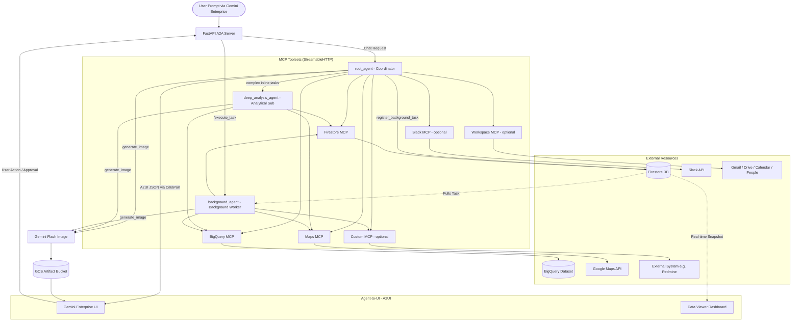
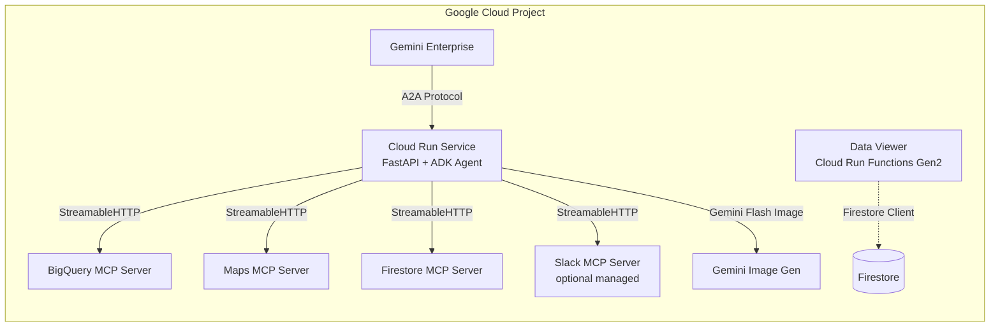

# GE Demo Generator — Architecture

This document describes the system architecture of the GE Demo Generator and the synthesized demo environments it produces.

---

## 1. Overview

The GE Demo Generator is a low-code accelerator built on Google Apps Script that allows users to instantly synthesize fully functional AI agent demo environments for any business domain. It generates domain-specific datasets, an ADK-based agent with MCP toolsets, and a real-time operations dashboard — all provisioned into the user's own Google Cloud project.

The system is divided into two main parts: the **Generator Dashboard** (the Apps Script web app) and the **Synthesized Demo Environment** (the Google Cloud resources created by the setup script).

---

## 2. Generator Dashboard (Google Apps Script Web App)

### 2.1 Frontend (`index.html`)

A Tailwind-based Single Page Application that provides:

- **Demo Wizard**: Step-by-step UI to input business requirements, configure options (row count, table count, public dataset enrichment), and generate the demo.
- **Customer Domain Research**: Gemini-powered company research via Google Search grounding — automatically identifies business challenges and agent-automatable workflows from a customer's domain.
- **Data Preview**: Inline data tables and ER diagrams for the generated datasets.
- **Setup Script Export**: One-click copy of the generated bash setup script for Cloud Shell.
- **Demo Guide**: Auto-generated demo prompts tailored to the synthesized domain.
- **MCP Server Catalog**: A curated catalog of pre-configured MCP servers organized by category (Government & Legal, Finance & Markets, Social & Communication, Japan-Specific, Google Official), with one-click add, recipe bundles, and search/filter. Includes both sidecar (GitHub-based) and remote managed servers (e.g., Slack).
- **MCP URL Import**: Import third-party MCP servers from any GitHub repository via Gemini-powered analysis.
- **System Instruction Editor**: Edit the agent's business and technical instructions post-generation.
- **Onboarding & Feature Notifications**: First-run onboarding modal and feature notification system for new capabilities.

### 2.2 Backend (`Code.gs`)

A monolithic Google Apps Script file that contains:

| Module | Key Functions | Description |
|---|---|---|
| **Configuration** | `CONFIG`, `checkConfiguration` | Script Property-driven config; startup validation |
| **Web App Entry** | `doGet` | Serves `index.html` or `SetupError.html` based on config state |
| **Data Generation** | `generateDemo`, `planAndGenerateData`, `buildPlanningPrompt` | Orchestrates the full generation pipeline using Gemini |
| **Public Dataset Discovery** | `discoverPublicDataset`, `verifyAndResolveTable` | Uses Google Search grounding to find and verify real BigQuery public datasets |
| **Data Validation** | `validateGeneratedData`, `validateAndRepairValue` | Schema-aware validation and auto-repair of generated CSV data |
| **Setup Script Synthesis** | `generateSetupScript` | Generates a comprehensive bash script including all Cloud resources, agent code, Dockerfile, and deployment logic |
| **Usage Logging** | `logUsageToSheet` | Usage logging to Google Sheets |
| **Vertex AI Utilities** | `callVertexAI`, `callVertexAIWithSearch`, `executeWithRetry` | API calls with retry logic and Google Search grounding |
| **Customer Domain Research** | `researchCompanyByDomain`, `mergeTemplateWithCompanyInfo` | Google Search-grounded company research, challenge identification, and workflow discovery |
| **MCP Import & Analysis** | `analyzeMcpRepository` | Analyzes GitHub repos via `gemini-3.1-flash-lite` and integrates custom MCP servers as co-located sidecars in the agent container |

### 2.3 Error Handling (`SetupError.html`)

A standalone HTML page displayed when mandatory Script Properties (`PROJECT_ID`, `LOG_SHEET_URL`) are missing. Provides instructions for both the `initializeProject()` function and manual Script Properties setup.

---

## 3. Synthesized Demo Environment (Google Cloud)

When the user runs the generated setup script in Cloud Shell, the following architecture is provisioned:

### 3.1 Data Layer

```
┌─────────────────────────────────────────────────┐
│  BigQuery                                       │
│  ├── Dataset: demo_<domain>_<suffix>            │
│  │   ├── Table 1 (e.g., sales_transactions)     │
│  │   ├── Table 2 (e.g., product_inventory)      │
│  │   └── Table 3 (e.g., customer_segments)      │
│  └── (Optional) Public Dataset Reference        │
│       e.g., bigquery-public-data.noaa_gsod.*    │
├─────────────────────────────────────────────────┤
│  Firestore                                      │
│  └── Collection: demo-<domain>-<suffix>-data    │
│       ├── Document 1 (operational record)       │
│       ├── Document 2 ...                        │
│       └── Document N                            │
└─────────────────────────────────────────────────┘
```

### 3.2 Agent Architecture

The synthesized agent uses a **triple-agent architecture** for optimal latency, cost, and autonomous execution. A coordinator handles the majority of chat interactions, an analytical sub-agent is delegated to for complex inline reasoning, and a standalone background worker processes long-running tasks and scheduled cron jobs asynchronously.

```
┌──────────────────────────────────────────────────────────────┐
│  root_agent (LlmAgent — Coordinator)                         │
│  Model: gemini-3.5-flash (AGENT_MODEL_LITE)          │
│  Role: Handles most interactions directly                     │
│  Instruction: Generated system prompt + A2UI schema          │
│               + Model Routing Rules + Background Tasking     │
│                                                              │
│  Tools (shared):                                             │
│  ├── BigQuery MCP Toolset (execute_sql, list_tables, ..)     │
│  ├── Maps MCP Toolset (search_places, compute_routes,..)     │
│  ├── Firestore MCP Toolset (get_document, update_doc,..)     │
│  ├── generate_image (custom Python function → Gemini)        │
│  ├── Slack MCP Toolset (optional, managed remote)            │
│  ├── Custom MCP Toolsets (optional, user-imported)           │
│  └── Workspace MCP Toolsets (optional)                       │
│       ├── Gmail MCP                                          │
│       ├── Drive MCP                                          │
│       ├── Calendar MCP                                       │
│       └── People MCP                                         │
│                                                              │
│  ┌──────────────────────────────────────────────────────┐    │
│  │  deep_analysis_agent (LlmAgent — Analytical Sub)     │    │
│  │  Model: gemini-3.5-flash (AGENT_MODEL)               │    │
│  │  Role: Complex inline multi-step analysis             │    │
│  │  Tools: Same shared toolset                           │    │
│  │  Transfer: Returns to root_agent on completion        │    │
│  └──────────────────────────────────────────────────────┘    │
│                                                              │
│  ┌──────────────────────────────────────────────────────┐    │
│  │  background_agent (LlmAgent — Background Worker)     │    │
│  │  Model: gemini-3.5-flash (AGENT_MODEL)               │    │
│  │  Role: Async pipeline execution & cron tasks          │    │
│  │  Tools: BigQuery, Maps, Firestore, Custom MCP         │    │
│  │  Trigger: /execute_task endpoint (Firestore-backed)   │    │
│  └──────────────────────────────────────────────────────┘    │
│                                                              │
│  Callbacks (both agents):                                    │
│  ├── inject_image_callback (attaches generated images)       │
│  └── a2ui_metadata_callback (sets a2a:response flag)         │
│                                                              │
│  Plugins:                                                    │
│  ├── ReflectAndRetryToolPlugin (automatic tool retry)        │
│  └── LoggingPlugin (structured logging)                      │
│                                                              │
│  App Config:                                                 │
│  ├── EventsCompactionConfig (interval=20, overlap=3)         │
│  └── ContextCacheConfig (min_tokens=2048, ttl=3600s)         │
└──────────────────────────────────────────────────────────────┘
```

**Routing logic**: The coordinator delegates to `deep_analysis_agent` only when a request requires 3+ sequential tool calls with intermediate reasoning, cross-table correlation, or strategic business recommendations. Long-running background tasks and scheduled cron jobs are routed to `background_agent` via Firestore task registration and the `/execute_task` endpoint. All other interactions—including A2UI card generation, simple queries, and Firestore operations—are handled directly by the coordinator.

**Model configurability**: The setup script accepts `--model <name>` and `--model-lite <name>` CLI flags to override the default model assignments. The selected models are persisted to the `.env` file and read via `AGENT_MODEL` / `AGENT_MODEL_LITE` environment variables at runtime.

**Context caching**: The `App` object is configured with `ContextCacheConfig` to cache system instructions and schemas when exceeding 2048 tokens, keeping the cache warm for 1 hour to maximize performance.

**Model transparency**: The FastAPI A2A server injects a `🧠 Model: <name>` status event into the streaming response the first time each agent processes a request, providing real-time visibility into which model is handling the interaction.

### 3.3 Image Generation

The `generate_image` tool uses `gemini-3.1-flash-image-preview` to generate professional infographics and business summary visuals. Generated images are stored in the session state and automatically injected into the LLM response via the `inject_image_callback`. In Cloud Run deployments, images are uploaded to a GCS artifact bucket for rendering in Gemini Enterprise.

### 3.4 A2A Server (FastAPI)

The agent is served via a **FastAPI application** (`fast_api_app.py`) that implements the A2A (Agent-to-Agent) protocol:

- **A2A JSON-RPC endpoint** at `/a2a/<app-name>` for receiving tasks from Gemini Enterprise or other A2A clients.
- **Agent Card** served at `/.well-known/agent.json` with A2UI extension capabilities.
- **A2UI Stream Parser**: The A2UI SDK's `A2uiStreamParser` handles incremental JSON healing, component-level yielding, and schema validation during response streaming.
- **Token Extraction Middleware**: Captures OAuth tokens from HTTP headers or request body for Workspace MCP authentication passthrough.
- **GCS Artifact Service**: Stores generated images in GCS for Gemini Enterprise file rendering.
- **Model Announcement**: Emits model name in the streaming accordion header once per agent per request for runtime transparency.
- **Background Runner & `/execute_task` Endpoint**: Houses a secondary async runner (`background_app`) utilizing the `background_agent` that listens on `/execute_task` to process background operational pipeline workflows and scheduled cron task jobs.

### 3.5 Data Viewer Dashboard

A lightweight Flask application deployed as a **Cloud Run Function (Gen2)** that provides:

- Real-time polling of the Firestore collection
- Bento Grid card layout for each operational document
- KPI summary cards (Total Records, Requires Action, Resolved)
- Chart.js-powered status distribution chart
- Interactive audit trail / activity log
- Add, Update Status, and Delete operations

### 3.6 A2UI (Agent-to-UI) Protocol

The A2UI integration provides rich interactive UI components in Gemini Enterprise:

- **Schema Management**: `A2uiSchemaManager` with `BasicCatalog` provides schema validation and example injection into the system prompt.
- **Tag-Based Extraction**: The agent wraps UI payloads in `<a2ui-json>` tags. The stream parser extracts, heals, and validates these payloads.
- **DataPart Conversion**: A2UI JSON payloads are converted to A2A `DataPart` objects for proper rendering in Gemini Enterprise.
- **Interactive Components**: Cards, Columns, Rows, Buttons (with `sendText` actions), Dividers, Tabs, Text, Icons, Images, Modals, Forms (with `dataModelUpdate` for data binding), Lists, and suggestion chip bars.
- **Form Data Binding**: Interactive forms use `dataModelUpdate` messages for initial values and `path`-based bindings for TextField (supporting `shortText` and multi-line `longText`), Slider, CheckBox, and DateTimeInput components.
- **Welcome Onboarding Card**: Rendered on the first user interaction. Features a customized list of key capabilities using Icon + Text rows and action buttons designed to initiate immediate/background operations.
- **Workflow Execution Plan**: Standardized layout for batch operations. Features a mandatory subtitle declaring sequential pipeline step order, connector arrows (` ↓ `), numbered step prefixes (`Step N/M :`), real-time status icons (`play_arrow`, `check_circle`, `hourglass_empty`, `pan_tool`, `error`), and dual control rows (Execution Mode buttons and Control buttons). Employs a progress variant for real-time console status sync.
- **Context-Aware Suggestion Chips**: Section added at the end of every response using a dedicated Column schema (root -> Column [Divider, Section Title '💡 Next Actions', chipRow]) with context-aware labels to expand conversation paths.
- **Fallback**: If the stream parser fails, a regex-based fallback extracts A2UI blocks to prevent data loss.

---

## 4. MCP Server Integration

### 4.1 Built-in MCP Servers

| Server | Transport | Description |
|---|---|---|
| **BigQuery MCP** | StreamableHTTP | SQL execution (SELECT + full DML), schema exploration |
| **Google Maps MCP** | StreamableHTTP | Places, routes, geocoding |
| **Firestore MCP** | StreamableHTTP | Document CRUD, collection management |

### 4.2 MCP Server Catalog

The frontend includes a curated MCP catalog with servers organized into categories:

| Category | Servers |
|---|---|
| **Government & Legal** | US Government Open Data, US Legal & Legislation |
| **Finance & Markets** | Yahoo Finance |
| **Social & Communication** | LINE Bot, Slack (managed remote) |
| **Japan-Specific** | MLIT Data Platform, Japanese Tax Law, Japanese Labor Law, National Diet Proceedings |
| **Google Official** | Google Workspace MCP (Gmail, Drive, Calendar, People) |

The catalog also includes **recipe bundles** — pre-configured combinations of MCP servers for common demo scenarios (e.g., Public Data Analyst, Compliance Monitor, Japan Market Intelligence).

### 4.3 MCP Server Types

| Type | Transport | Provisioning |
|---|---|---|
| **Sidecar (GitHub)** | `supergateway` stdio→StreamableHTTP (`--sessionStateless`) | Cloned into Docker image, bridged via `supergateway` on a per-port basis |
| **Remote Managed (Slack)** | StreamableHTTP direct | OAuth2 flow during setup; token stored in Secret Manager |
| **Google Workspace** | StreamableHTTP direct | MCP OAuth with token passthrough from Gemini Enterprise |

### 4.4 Custom MCP Import (URL)

Users can import any GitHub-hosted MCP server by providing the repository URL. The system:
1. Fetches repository contents via Gemini-powered analysis (`gemini-3.1-flash-lite`)
2. Identifies the entrypoint, language, required environment variables, and capabilities
3. Generates the Dockerfile sidecar configuration and `supergateway` bridge commands
4. Supports deduplication to prevent adding the same server twice

---

## 5. Data Flow Architecture



---

## 6. Deployment Targets

The setup script offers three deployment options and supports model override via CLI flags:

```bash
# Default models
bash setup-demo-xxx.sh

# Override models
bash setup-demo-xxx.sh --model gemini-2.5-pro --model-lite gemini-2.5-flash

# Cleanup
bash setup-demo-xxx.sh --cleanup
```

| Option | Description | Use Case |
|---|---|---|
| **[1] Local** | Launches `adk web` on a local port (8000 or 8080 in Cloud Shell) | Quick testing and iteration |
| **[2] Cloud Run** | Builds Docker image, deploys to Cloud Run with `--min-instances 1` | Shareable demo with a permanent URL, no cold start |
| **[3] Gemini Enterprise** | Cloud Run deployment + Discovery Engine agent registration | Production-grade agent accessible in Gemini Enterprise UI |

### Deployment Architecture (Option 3 — Gemini Enterprise)



---

## 7. Synthesized Project Structure

After running the setup script, the following directory structure is created:

```
~/demo-<domain>-<suffix>/
├── setup-demo-<domain>-<suffix>.sh   # The setup script itself
├── .venv/                             # Python virtual environment
├── .env                               # Runtime environment variables
│                                      # (AGENT_MODEL, AGENT_MODEL_LITE, etc.)
├── .python-version                    # Python 3.11
├── pyproject.toml                     # ADK project metadata
├── requirements.txt                   # Python dependencies
├── Dockerfile                         # Container build definition
│                                      # (includes supergateway for custom MCP)
├── .dockerignore                      # Excludes .venv from Docker
├── adk_agent/
│   └── app/
│       ├── __init__.py
│       ├── agent.py                   # LlmAgent definitions (root_agent, deep_analysis_agent, background_agent)
│       │                              # + A2UI schema manager + ContextCacheConfig + plugins
│       ├── tools.py                   # MCP toolset factories + generate_image
│       │                              # + Workspace MCP + Slack MCP
│       ├── fast_api_app.py            # A2A server, background task runner, streaming, middleware
│       ├── part_converters.py         # A2A↔GenAI type conversion utilities
│       ├── examples/0.8/             # A2UI BasicCatalog example JSONs
│       └── app_utils/
│           ├── telemetry.py           # Cloud Trace setup
│           └── typing.py             # Pydantic models
└── viewer_app/
    └── main.py                        # Flask Data Viewer (deployed to Cloud Run Functions)
```

---

## 8. Execution Sequence

### Example: User updates a database record via the agent

1. **Prompt**: The user says in Gemini Enterprise: *"Approve safety issue #104 and log update notes."*
2. **A2A Routing**: Gemini Enterprise sends the message via A2A JSON-RPC to the Cloud Run FastAPI server.
3. **Model Announcement**: The server emits a `🧠 Model: gemini-3.5-flash` status event in the thinking accordion.
4. **Reasoning**: The `root_agent` identifies a write request and plans to use the Firestore MCP toolset.
5. **Confirmation**: The agent renders an A2UI confirmation card (via `<a2ui-json>` tags) showing before/after data with Approve/Reject buttons and a `dataModelUpdate` for pre-populated fields.
6. **User Approval**: The user clicks "Approve" in the interactive card, which sends a `sendText` action back to the agent.
7. **Tool Execution**: The agent invokes the Firestore MCP `update_document` tool.
8. **A2UI Cleanup**: The agent issues a `deleteSurface` command to remove the confirmation card, then renders a success summary card with follow-up suggestion chips.
9. **Real-time Sync**: The Data Viewer dashboard independently detects the Firestore change and updates its Bento Grid display.

---

## 9. Design Patterns & Stability Patches

### Schema Compatibility
- **`_safe_dereference_schema`**: Patches ADK's internal `_dereference_schema` function to handle complex nested JSON schemas with `$ref` and `$defs` — prevents validation errors when registering MCP tools with deeply nested schemas (e.g., Firestore). Includes JSON Pointer resolution for arbitrary `$ref` paths.
- **`_ensure_types`**: Transforms incorrectly formatted schema properties (e.g., string literals where objects are expected). Flattens `anyOf`/`oneOf` to the first non-null variant for Gemini API compatibility.

### Network & Session Stability
- **HTTP/2 Disable Patch**: Monkeypatches `httpx.AsyncClient` to force HTTP/1.1 connections, preventing intermittent connection resets with MCP servers.
- **MCP CancelScope Fix**: Patches `SessionContext._run()` to remove `asyncio.wait_for()` wrapper, fixing "Attempted to exit cancel scope in a different task" errors in AnyIO.
- **Graceful Error Handling**: `ADK_ENABLE_MCP_GRACEFUL_ERROR_HANDLING=1` environment variable enables ADK's built-in error recovery for MCP tool failures.
- **Extended Timeouts**: MCP connections use 300s read / 60s connect timeouts with async-safe token caching to handle sidecar cold starts.

### A2UI Rendering
- **Bento Layout Strategy**: All UI screens use compact grid layouts to prevent visual clutter in presentations.
- **A2UI Stream Parser**: Uses the SDK's `A2uiStreamParser` for incremental JSON healing, component validation, and streaming.
- **Regex Fallback**: When the stream parser fails on malformed JSON, a regex-based fallback extracts A2UI blocks to prevent data loss.
- **Artifact Text/Media Separation**: `fast_api_app.py` separates text and media parts — text is cleared on each tool call so only the final model turn's text appears in the artifact, while images and A2UI cards are always preserved.

### Deployment Resilience
- **Ingress Org-Policy Graceful Failure**: Setup scripts detect and gracefully handle organization policies that block unauthenticated Cloud Run endpoints (e.g., `constraints/iam.allowedPolicyMemberDomains`).
- **Static Agent Card**: The A2A server builds an `AgentCard` without connecting to MCP servers at startup, preventing hangs from slow/broken MCP connections. MCP tool connections happen lazily on first user request.
- **Parallel BQ Loading**: BigQuery table loading uses `xargs -P 5` for parallel CSV uploads.
- **Min Instances**: Cloud Run deployments use `--min-instances 1` to eliminate cold-start latency for demo presentations.
- **Supergateway Stateless Sessions**: Custom MCP sidecars use `supergateway --sessionStateless` to prevent process accumulation from multiple client connections.

### Token Management
- **Token Extraction Middleware**: A Starlette middleware captures OAuth tokens from multiple sources (Authorization header, x-authorization header, JSON body) and stores them in `builtins._workspace_oauth_token` for Workspace MCP authentication passthrough.
- **Async Token Cache**: MCP authentication tokens are cached with async-safe locking and automatic expiry refresh.

### Agent Resilience
- **Context Caching**: `ContextCacheConfig` caches the system instruction and A2UI schema (>= 2048 tokens) for 1 hour with 10-invocation revalidation, reducing time-to-first-token.
- **Events Compaction**: `EventsCompactionConfig` compacts event history every 20 events with a 3-event overlap to prevent context window overflow in long conversations.
- **ReflectAndRetryToolPlugin**: Automatically retries failed tool calls with error reflection, improving robustness against transient MCP failures.
- **Tool Name Deduplication**: `get_custom_mcp_toolsets` uses `tool_name_prefix` to prevent "Duplicate function declaration" errors when multiple MCP servers expose identical tool names.
- **Retry Options**: Both models are configured with `HttpRetryOptions` (8 attempts, exponential backoff 2s–60s) specifically targeting HTTP 429 (Resource Exhausted) errors.
